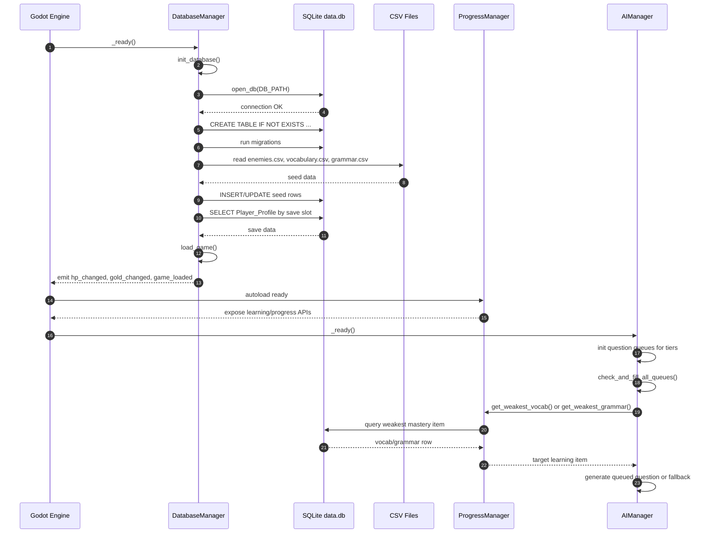
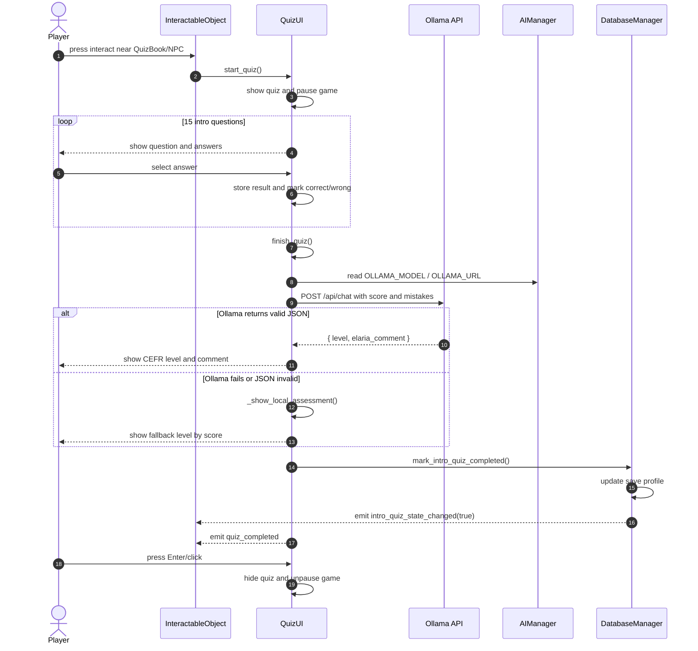
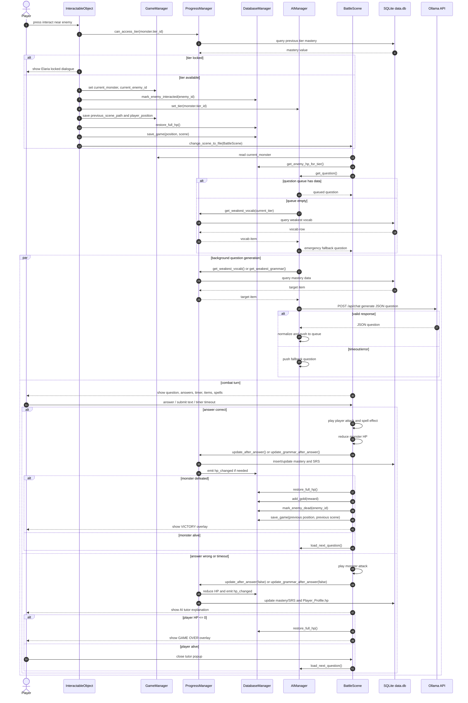
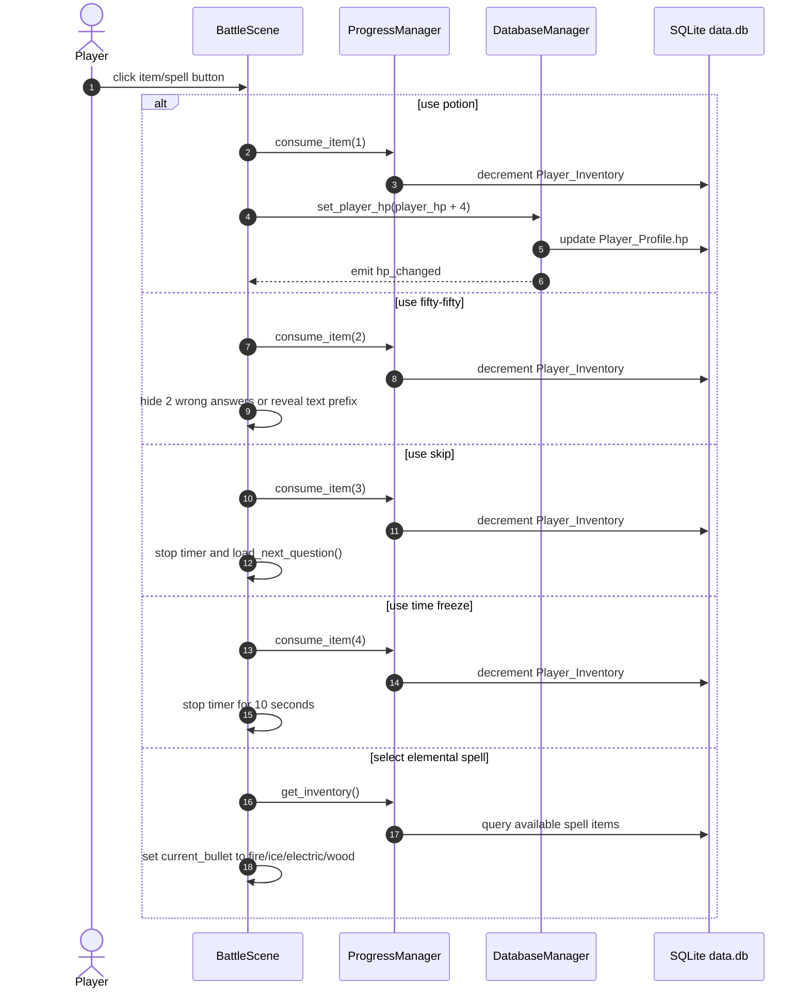
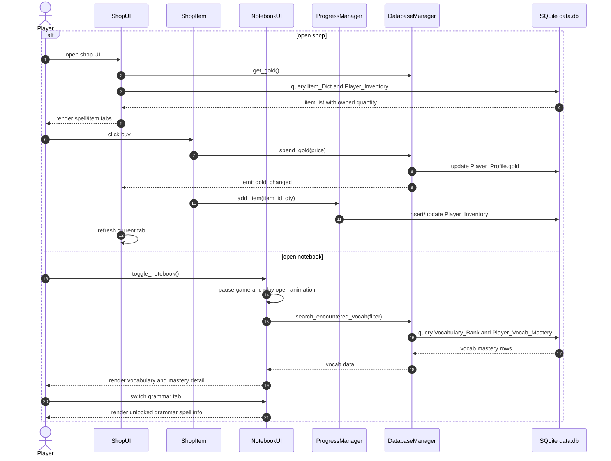

# Sequence Diagram - AI English Learning RPG

Tai lieu nay mo ta cac luong tuong tac chinh cua he thong game Godot: khoi dong game, quiz dau game, chien dau hoc tu vung/ngu phap, shop va notebook.

## 1. Khoi Dong Game Va Nap Du Lieu

## 2. Quiz Dau Game Va Danh Gia CEFR

## 3. Luong Chien Dau Hoc Tap

## 4. Dung Vat Pham Va Phep Trong Tran Dau

## 5. Shop Va Notebook

